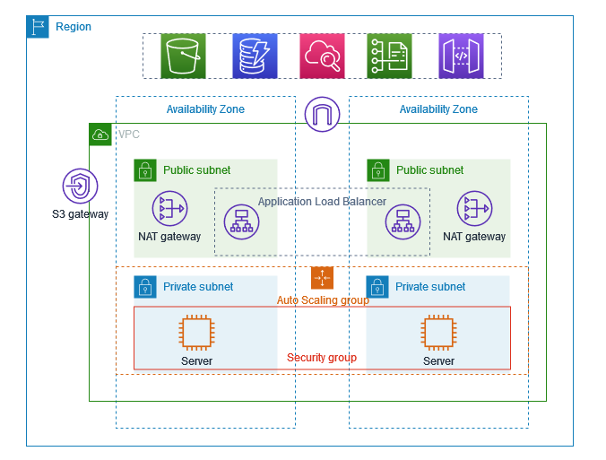

# AWS VPC Production Environment Project

## Day 7 - AWS For DevOps Learning Series

This project demonstrates the implementation of a production-ready AWS VPC infrastructure with high availability, scalability, and security best practices.

## 🏗️ Architecture Overview

The project creates a robust cloud infrastructure using the following AWS services:
- **VPC (Virtual Private Cloud)** - Isolated network environment
- **Public & Private Subnets** - Network segmentation across multiple AZs
- **EC2 Auto Scaling** - Automatic scaling based on demand
- **Application Load Balancer** - Traffic distribution and high availability
- **Target Groups** - Health monitoring and routing
- **Bastion Host** - Secure access to private resources
- **Security Groups** - Network-level security controls

## 🌐 VPC Architecture



## 🛠️ Components Breakdown

### 1. VPC (Virtual Private Cloud)
- **CIDR Block**: 10.0.0.0/16
- **Purpose**: Isolated network environment for all resources
- **Features**: 
  - DNS resolution enabled
  - DNS hostnames enabled
  - Dedicated tenancy (optional)

### 2. Subnets Configuration

#### Public Subnets
- **Public Subnet 1**: 10.0.1.0/24 (AZ-1a)
- **Public Subnet 2**: 10.0.2.0/24 (AZ-1b)
- **Features**:
  - Internet Gateway attached
  - Auto-assign public IP enabled
  - Hosts Load Balancer and Bastion Host

#### Private Subnets
- **Private Subnet 1**: 10.0.3.0/24 (AZ-1a)
- **Private Subnet 2**: 10.0.4.0/24 (AZ-1b)
- **Features**:
  - NAT Gateway for outbound internet access
  - Hosts application servers
  - No direct internet access

### 3. EC2 Auto Scaling Group
- **Configuration**:
  - Minimum instances: 2
  - Maximum instances: 6
  - Desired capacity: 2
  - Health check type: ELB
  - Health check grace period: 300 seconds
- **Scaling Policies**:
  - Scale up when CPU > 70%
  - Scale down when CPU < 30%
- **Launch Template**:
  - Instance type: t3.micro (or t2.micro for free tier)
  - AMI: Amazon Linux 2
  - User data script for web server setup

### 4. Application Load Balancer (ALB)
- **Type**: Application Load Balancer
- **Scheme**: Internet-facing
- **Listeners**: HTTP (Port 80), HTTPS (Port 443)
- **Availability Zones**: Both AZ-1a and AZ-1b
- **Features**:
  - Cross-zone load balancing
  - Deletion protection
  - Access logging (optional)

### 5. Target Group
- **Target Type**: Instance
- **Protocol**: HTTP
- **Port**: 80
- **Health Check**:
  - Path: /health or /
  - Interval: 30 seconds
  - Timeout: 5 seconds
  - Healthy threshold: 2
  - Unhealthy threshold: 5

### 6. Bastion Host (Jump Server)
- **Purpose**: Secure access to private subnet resources
- **Instance Type**: t3.micro
- **Placement**: Public subnet
- **Security**: Key-pair authentication only
- **Features**:
  - Elastic IP attached
  - SSH access from specific IP ranges
  - Acts as gateway to private instances

### 7. Security Groups

#### Load Balancer Security Group
```
Inbound Rules:
- HTTP (80) from 0.0.0.0/0
- HTTPS (443) from 0.0.0.0/0

Outbound Rules:
- HTTP (80) to Web Server SG
- HTTPS (443) to Web Server SG
```

#### Web Server Security Group
```
Inbound Rules:
- HTTP (80) from ALB Security Group
- SSH (22) from Bastion Security Group

Outbound Rules:
- HTTP (80) to 0.0.0.0/0
- HTTPS (443) to 0.0.0.0/0
```

#### Bastion Host Security Group
```
Inbound Rules:
- SSH (22) from Your IP/Corporate Network

Outbound Rules:
- SSH (22) to Web Server Security Group
- HTTP/HTTPS for package updates
```

## 🚀 Deployment Steps

### Phase 1: Network Infrastructure
1. Create VPC with DNS settings
2. Create Internet Gateway and attach to VPC
3. Create public and private subnets in two AZs
4. Create and configure route tables
5. Create NAT Gateway in public subnet

### Phase 2: Security Configuration
1. Create security groups with proper rules
2. Generate or import EC2 key pairs
3. Configure Network ACLs (if needed)

### Phase 3: Compute Resources
1. Create Launch Template for Auto Scaling
2. Deploy Bastion Host in public subnet
3. Create Target Group with health checks
4. Create Application Load Balancer
5. Create Auto Scaling Group

### Phase 4: Testing and Validation
1. Test Load Balancer endpoint
2. Verify Auto Scaling policies
3. Test Bastion Host connectivity
4. Validate security group rules

## 🔒 Security Best Practices Implemented

- **Network Segmentation**: Public/private subnet separation
- **Least Privilege Access**: Restrictive security group rules
- **Multi-AZ Deployment**: High availability across zones
- **Bastion Host**: Controlled access to private resources
- **Auto Scaling**: Automatic response to demand changes
- **Health Checks**: Continuous monitoring of instance health

## 📊 Monitoring and Health Checks

### Load Balancer Health Checks
- **Health Check Path**: `/health` endpoint
- **Check Interval**: Every 30 seconds
- **Timeout**: 5 seconds
- **Success Codes**: 200

### Auto Scaling Health Checks
- **ELB Health Check**: Enabled
- **EC2 Health Check**: Basic monitoring
- **Grace Period**: 300 seconds

### CloudWatch Metrics
- CPU Utilization
- Network In/Out
- Request Count
- Target Response Time

## 🎯 Key Learning Outcomes

This project demonstrates:
- **VPC Design**: Creating isolated network environments
- **High Availability**: Multi-AZ deployment strategy
- **Auto Scaling**: Dynamic resource management
- **Load Balancing**: Traffic distribution and failover
- **Security**: Network-level and instance-level protection
- **Cost Optimization**: Efficient resource utilization

## 🔧 Customization Options

### Instance Types
- **Development**: t3.micro, t2.micro
- **Production**: t3.small, t3.medium, or larger
- **High Performance**: c5.large, m5.large

### Scaling Policies
- **Conservative**: Scale at 80% CPU, slower response
- **Aggressive**: Scale at 60% CPU, faster response
- **Custom Metrics**: Memory, disk, or application-specific

### Security Enhancements
- **VPC Flow Logs**: Network traffic monitoring
- **WAF Integration**: Web application firewall
- **SSL/TLS**: HTTPS termination at load balancer
- **Secrets Manager**: Secure credential management

## 📈 Cost Considerations

### Estimated Monthly Costs (us-east-1)
- **VPC Components**: Free (NAT Gateway ~$45/month)
- **EC2 Instances**: t3.micro ~$8.5/instance/month
- **Load Balancer**: ~$16/month
- **Data Transfer**: Variable based on usage

### Cost Optimization Tips
- Use t3.micro for development/testing
- Implement proper Auto Scaling policies
- Consider Reserved Instances for predictable workloads
- Monitor and optimize data transfer costs

## 🚨 Troubleshooting Guide

### Common Issues
1. **Instances not healthy in Target Group**
   - Check security group rules
   - Verify health check path exists
   - Check instance status

2. **Cannot SSH to Bastion Host**
   - Verify security group allows SSH from your IP
   - Check key pair permissions (chmod 400)
   - Verify Elastic IP is attached

3. **Auto Scaling not working**
   - Check CloudWatch metrics
   - Verify scaling policies
   - Review IAM roles and permissions

## 📚 Next Steps for Enhancement

1. **Database Integration**: Add RDS in private subnets
2. **Content Delivery**: Implement CloudFront CDN
3. **Monitoring**: Set up comprehensive CloudWatch dashboards
4. **Backup Strategy**: Implement EBS snapshots and cross-region backups
5. **Infrastructure as Code**: Convert to Terraform or CloudFormation
6. **CI/CD Pipeline**: Integrate with CodePipeline and CodeDeploy

## 🏆 Project Achievement

This project successfully demonstrates a production-ready AWS infrastructure that provides:
- **99.9% Availability** through multi-AZ deployment
- **Auto-scaling capabilities** for dynamic workloads
- **Secure network architecture** with proper isolation
- **Cost-effective resource management**
- **Monitoring and health checks** for operational excellence

---

**AWS DevOps Learning Series - Day 7 Complete! 🎉**

*This project showcases the fundamental building blocks of cloud infrastructure and prepares you for more advanced AWS services and architectural patterns.*